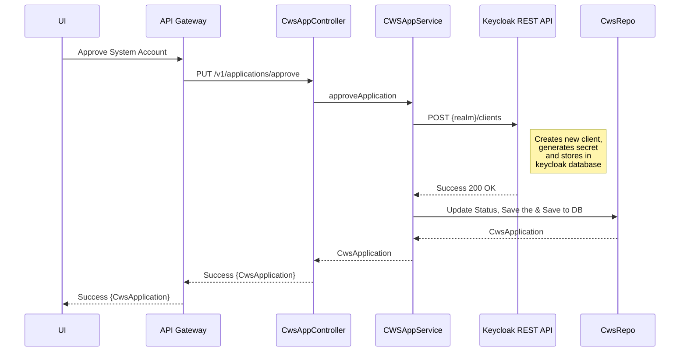
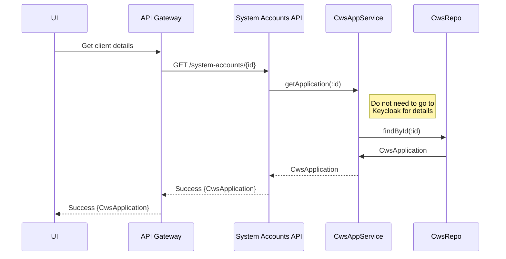
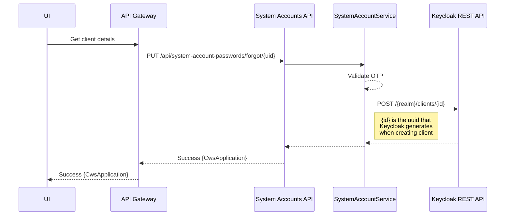
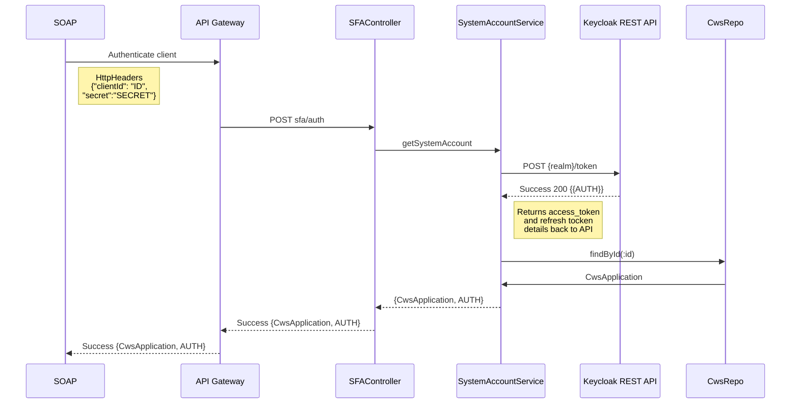

## System Accounts migration to Okta IAM 

Objective is to migrate existing system accounts Okta IAM solution with *minimal*  impact to existing functionality. This migration is inline with future road map to utilize OAuth2 as authentication and authorization solution.  

 - [x] Install and run keycloak on local environment. Keycloak can be installed as standalone or domain mode on Wildfly or JBOSS EAP servers. For POC we are using docker container with postgres for persistence	
 - [x] Create new realm **system accounts** . Realm can be generated multiple ways
	 - Login to admin console and create a new realm system-accounts. For POC we opted this option
	 - Import predefined JSON to create a new realm from the admin console
	 - Use REST API to create new realm
 - [x] Create a new user to manage/administrator system-accounts realm. This user must have minimum role **create-client** to create new clients. 
 
	 *Note: Currently forgerock admin user password is rotated every 6 months to an year. Might as well have to set a similar policy for this user in keycloak and update the market place variables and restart the system-accounts application*
 
 - [x] Create new client with **Service Accounts Enabled** using REST API. This will auto generate a secret by default for the client  
 ```
 curl --location --request POST '{{KEYCLOAK_URL}}/auth/admin/realms/system-accounts/clients' \
--header 'Content-Type: application/json' \
--header 'Authorization: Bearer {{ACCESS_TOKEN}} \
--data-raw '{
    "clientId": "sys-client-2",
    "enabled": true,
    "serviceAccountsEnabled": true
}'
 ```
 - [x] Update/Reset client secret using REST API
 ```
 curl --location --request POST '{{KEYCLOAK_URL}}/auth/admin/realms/system-accounts/clients/{{UUID}}/client-secret' \
--header 'Content-Type: application/json' \
--header 'Authorization: Bearer {{ACCESS_TOKEN}} \
--data-raw ''
 ```
 - [x] Get client secret 
 ```
 curl --location --request GET '{{KEYCLOAK_URL}}/auth/admin/realms/system-accounts/clients/{{UUID}}/client-secret' \
--header 'Content-Type: application/json' \
--header 'Authorization: Bearer {{ACCESS_TOKEN}} \
--data-raw ''
 ```
 - [x] Test client authorization using secret and client ID
 ```
 curl --location --request POST '{{KEYCLOAK_URL}}/auth/realms/system-accounts/protocol/openid-connect/token' \
--header 'Content-Type: application/x-www-form-urlencoded' \
--data-urlencode '{{CLIENT_ID}}' \
--data-urlencode '{{CLIENT_SECRET}}' \
--data-urlencode 'grant_type=client_credentials'
 ```
- [x] Analyze changes needed for  System Accounts API to integrate with Keycloak. Refactor following java classes and update the application.properites  file with Keycloak server details
	 - SystemAccountRestController.java
	 - SFAController.java
	 - SystemAccountService.java
	 - CwsAppService.java
 - [x] Database schema changes for System Accounts API:
	
	  *Note:* When creating new clients keycloak generates a **uuid** along with the secret.  This **uuid** is used by keycloak REST API to get client details.  If we do not store the uuid in system accounts DB then we have few following options to retrieve client details by client_id
	 1. *Preferred option* is to store the uuid in the system accounts DB when creating client
	 2. Use keycloak Java Client instead of REST API to get the client details by client_id
	 3. Get all clients using keycloak REST API and filter a client by client_id

 - [x] Analyze UI changes needed for calling updated System Accounts API. Refactor following *html* and *typescript* files based on new design
	 - review.component.html
	 - review.component.ts
	 - system-accounts-service.ts
<br/>
<br/>
<br/>
<br/>
<br/>
<br/>
<br/>
<br/>
<br/>
<br/>
<br/>
<br/>
<br/>
<br/>


### UML diagrams

####   Create new System Accounts client using keycloak REST API
GSA Security Approver approves a pending request than a new system accounts client will be created in keycloak.


####   Get System Accounts client details

<br/>

#### Reset System Accounts client secret 



#### Authenticate  System Accounts client using Keycloak REST API

<br/>
<br/>
<br/>
<br/>
<br/>

#### Dependencies

 1. Infrastructure team to provide keycloak instance for both lower and higher environments. For now one instance might be sufficient however for future may be it is better to have a clustered instances with load balancer  
 2. Have to run one time migration job to transfer all system accounts user to keycloak that will create clients and generates secret. This secret has to shared with the existing clients and has to be passed in the HttpHeader for authentication  

#### Questions: 
Below are some questions that were answered by **Ruchir Mehta** and team

1. Do we currently store all the System Accounts related the data in the DB. In other words, do both Forgerock and System Accounts DB have identical data?  

	A : At  each and every POST/PUT calls we keep all the fields mentioned in CWSApplication.java in the SystemAccount DB. (i.e. including status which will change from Draft, Pending Review, Pending Approval, Approved etc etc.).  
	Once GSA Security Approver gives final approval, the System Account DB will be updated with "Approved" Status(Refer : CWSAppConroller.java "/approve" method) and at the same time the Forgerock create api(Refer : SystemAccountService.java --> createAccount() and SystemAccount.java) will be called to create a new System Account.
	
2. Is there a data sync between Forgerock and System Accounts DB? If so, is there a schedule for that?

	A : No currently we do not have any sync job between Forgerock and System Accounts DB
	
3. Are there any other clients (other than the U/I) that utilize the System Accounts API?

	A : System Integration team(Orange) uses /sfa and /system-account endpoints(SystemAccountRestController.java and sfaController.java) for single factor authentication and retrieving System Account Details.

	Also They have some other business logic w.r.t. IP address and Roles

4. During creation of System Accounts, the client provides the IP addresses that can access the System Account APIs. We want to understand who validates the client IP addresses (is it the API gateway or Forgerock)?

	A: 2 Microservices - opportunities_soap_api , interface_api (Orange Team) validates the IP Address associated with System Account(by making sfa/auth call) with the SOAP/REST request IPs. There is no IP-Address Validation logic in forgerock or other microservices apart from (opportunities_soap_api , interface_api).

#### Assumptions:

 1. We are not migrating existing passwords from ForgeRock for POC or for the future implementation  

2. We assume that we are not considering 90 day password expiration policy for the Keycloak POC implementation. If required, this will be accounted for in the actual implementation once Keycloak is approved.  

3. Currently on deactivate, we see that the request is sent to Forgerock to deactivate and the System Account DB is getting updated at the same time. We do not see requirements for Deactivate action for the POC. Our assumption is that this feature will not be part of the POC and will be accounted for in the actual implementation once Keycloak is approved.  

4. Based on the POC requirements, we assume that only SOAP services will need to change to pass a client secret in the Auth header by the clients. Working with client teams for them to make these changes on their side is not part of the scope of this POC. This will be accounted for in the actual implementation once Keycloak is approved.

5. Based on POC requirements, we will identify changes needed in the U/I for set password, forgot password and reset password. However, the actual implementation will be accounted for once Keycloak is approved.
<!--stackedit_data:
eyJoaXN0b3J5IjpbNzAzODc1Njc3XX0=
-->